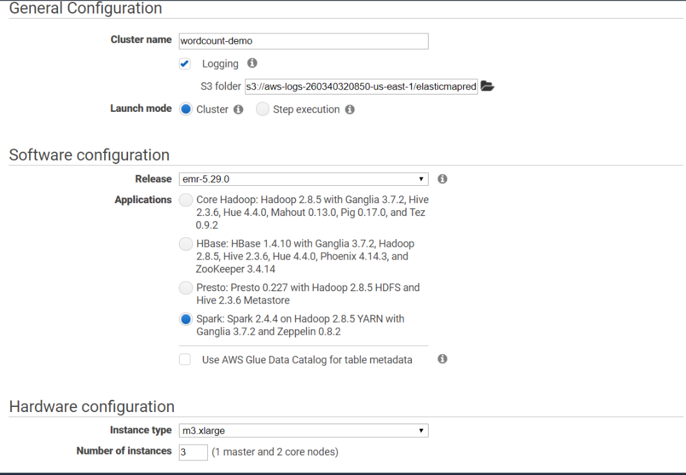
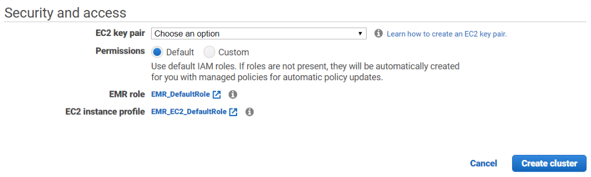

# Simple word count on Amazon EMR

The code was largely taken from [this repo](https://github.com/Aliga8or/csds-spark-emr). However, the original code couldn't handle unicode inupt and couldn't clean out punctuations. I tweaked the code a little bit to prepocess the input file so that only lower case words without punctuations will be counted.

### Steps
**Create Cluster**
- Log in to your AWS console and go to EMR to create a spark cluster with the following configurataions:
    
    

- Don't forget to choose or create a EC2 key pair so that we can ssh onto the master node later:
    
    

It will take around 15 minutes for the cluster to spin up. You should see the cluster status show `Ready` when it's fully up and running.

**Add inbound rule on master node**
- On your console page go to `Services -> EC2`
- From the left panel find `Security Group`
- Select the security group named `ElasticMapReduce-master` and edit its inbound rule from the `Inbound Rules` tab
- Add a new rule with `SSH` as the `Type` and ip of your machine that is going to be used to ssh onto the cluster as the `Source`

**Upload input file to S3**
- Go to `Services -> S3` and create a new bucket, untick `block all public access` to make the objects inside public to read
- Create a folder in the bucket and upload the `RomeoAndJuliet.txt` file from this repo. Or any text file you want to count the words from.

**Create code file on master node**
- Go back to `EMR`, and select the cluster you just created
- Near the "Master public DNS:" field click the SSH button and SSH on the master node with the platform of your choice
- In /home/hadoop create wordcount.py (`vi wordcount.py`)
- Copy over the contents from wordcount.py in this repo
- Don't forget to change the input file s3 url in the code to point to the text file in your bucket

**Run the spark application**
- Still on the master node, execute the script using 
     ```
     spark-submit wordcount.py | tee output.txt
     ```
You can view the logs and printed result of the word count application in `output.txt`
- (optional)You can have the output file copied to your s3 bucket by using
    ```
    aws s3 cp output.txt s3://my_bucket/my_folder/
    ```

**Terminate the cluster**
- Don't forget to terminate the cluster after you are done(EMR clusters will keep your bills going up even if it's not doing anything)
- Next time you need a cluster just create a new one and reuse the same key pair